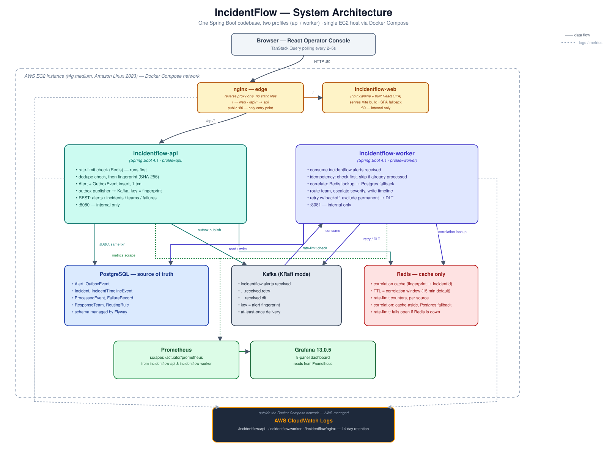
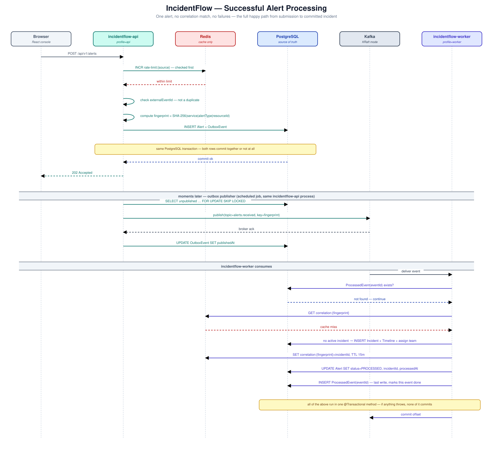
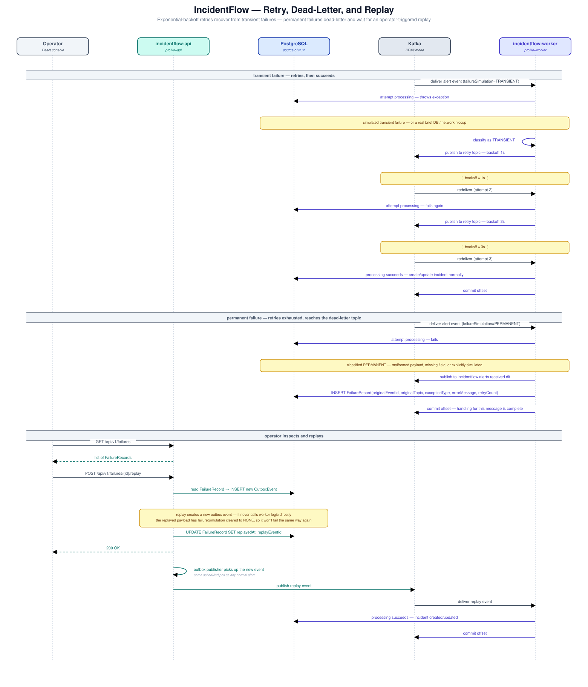
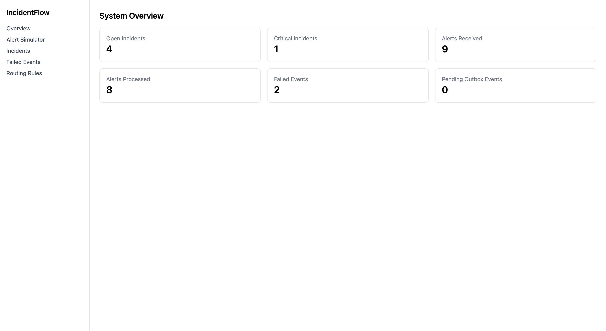
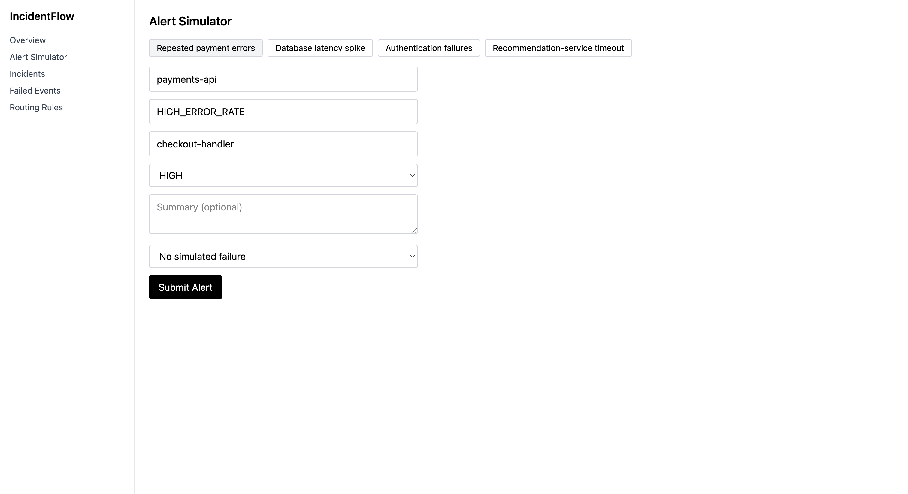
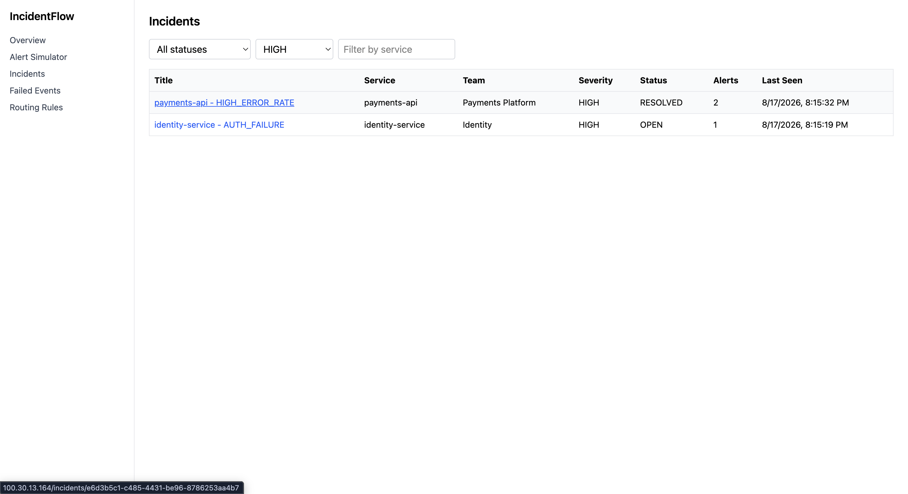
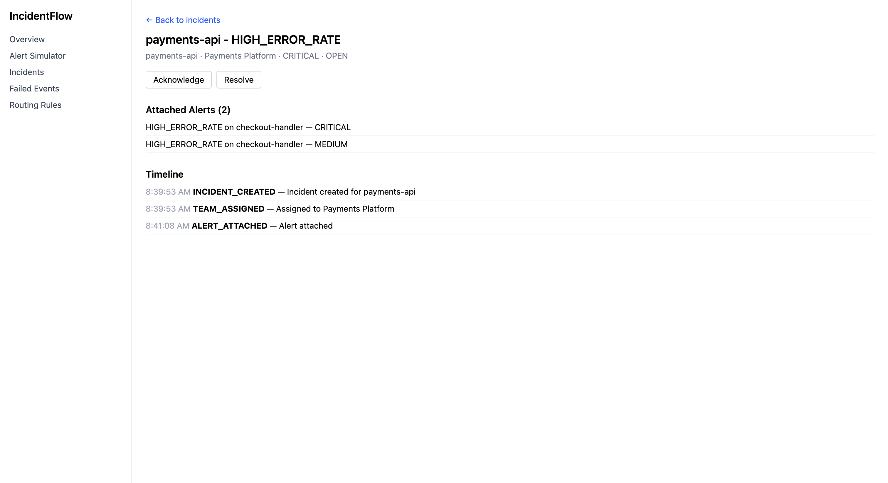
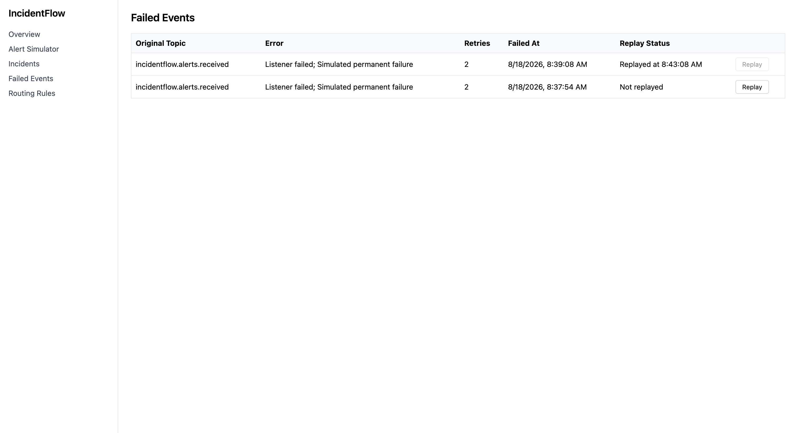
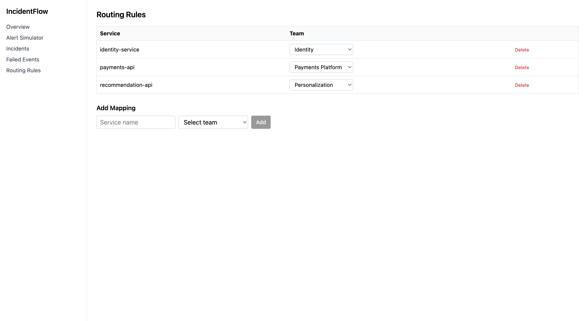
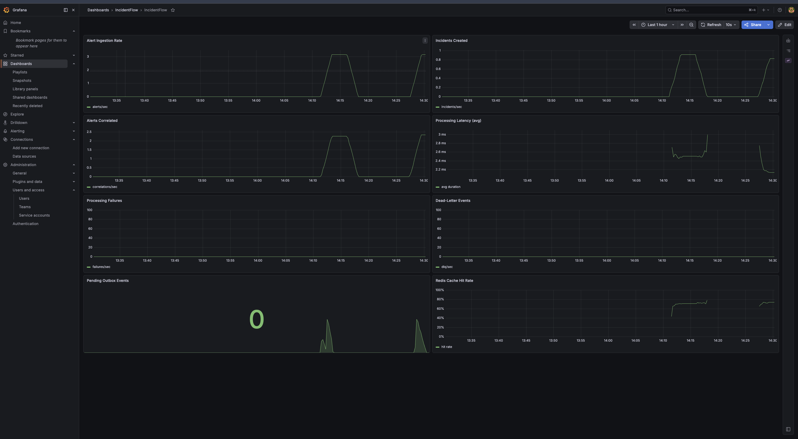

# IncidentFlow

A full-stack, event-driven incident-response platform that ingests operational alerts, correlates related alerts into incidents, routes incidents to responsible teams, and processes failures reliably using Kafka, Redis, PostgreSQL, retries, dead-letter handling, and idempotent consumers.

**This is a portfolio project using generated infrastructure-alert data.** It describes real architecture, real tests, and real deployment — not real customers, production traffic, or business impact.

[**Live demo**](http://100.30.13.164) · [**Demo video**](https://youtu.be/VBGF3spg6xg) · [Architecture](#architecture) · [API examples](#api-examples) · [Local setup](#running-locally)

---

## Problem

Production systems can generate large numbers of repetitive alerts during a single underlying failure. Processing every alert separately creates noise, duplicate incidents, conflicting updates, and unnecessary responder work. IncidentFlow centralizes this: alerts come in through a REST API, get durably recorded before any asynchronous processing happens, and get grouped into incidents, routed to the right team, deduplicated, retried on transient failure, and isolated in a dead-letter path on permanent failure — with a full audit timeline and an operator console to work through all of it.

## Feature Summary

- Submit simulated alerts, safely resubmit without creating duplicate work
- View an alert's processing state
- Browse and filter incidents by status, severity, service, and assigned team
- View an incident's attached alerts and full audit timeline; acknowledge and resolve incidents
- View and edit response-team routing rules
- Inspect and replay permanently failed events
- System-level counts and an 8-panel Grafana dashboard for infrastructure metrics
- One-command local startup via Docker Compose; a publicly deployed AWS version

## Technology Stack

**Backend:** Java 21, Spring Boot 4.1.0 (Spring Framework 7), Spring Web, Spring Data JPA, Spring Validation, Spring Kafka, Spring Boot Actuator, Gradle (Groovy DSL), Flyway, Jackson 3
**Frontend:** React 19, TypeScript 6, Vite 8, TanStack Query, React Router, Tailwind CSS v4
**Data & messaging:** PostgreSQL, Apache Kafka (KRaft mode), Redis
**Testing:** JUnit 5, Mockito, Testcontainers 2.x, Awaitility, Playwright
**Observability:** Micrometer, Prometheus, Grafana
**Load testing:** k6
**Infrastructure:** Docker, Docker Compose, GitHub Actions, AWS EC2, Nginx, AWS CloudWatch

## Architecture



One Spring Boot codebase runs as two independently-deployable processes, selected via `SPRING_PROFILES_ACTIVE`:

**API process** (`api` profile) — validates and normalizes incoming alerts, applies Redis-backed rate limiting, generates the correlation fingerprint, persists the alert and its outbox event atomically, exposes all REST endpoints, and runs the transactional outbox publisher on a scheduled poll.

**Worker process** (`worker` profile) — consumes alert events from Kafka, enforces idempotency, correlates alerts into incidents via the Redis cache with PostgreSQL fallback, applies severity escalation and team routing, writes timeline events, and handles retries and dead-lettering.

They share one Docker image and one JVM codebase; only the active profile differs. This is a deliberate service split, not a step toward microservices — request handling and asynchronous event processing have different scaling and failure characteristics, which is what justifies separating them at all.

## Alert-Processing Sequence



1. Client submits an alert to `POST /api/v1/alerts`.
2. `AlertService` checks the Redis rate limiter first — before anything else, including the duplicate check.
3. Duplicate `externalEventId` check against PostgreSQL; if it already exists, the existing alert is returned instead of creating a second row.
4. Fingerprint computed as `SHA-256(lowercase(trim(service)) + "|" + lowercase(trim(alertType)) + "|" + lowercase(trim(resourceId)))`.
5. In one PostgreSQL transaction: the `Alert` row and its `OutboxEvent` are both inserted.
6. API returns `202 Accepted`.
7. The outbox publisher (API process, polling every 5s by default) claims unpublished rows with `SELECT ... FOR UPDATE SKIP LOCKED`, publishes each to Kafka keyed by fingerprint, and marks it published.
8. The worker consumes the message, checks `ProcessedEvent` for a duplicate (see [Idempotency](#idempotency)), correlates or creates an incident, updates the Redis cache, writes timeline events, links the alert to the incident, and marks it `PROCESSED`.
9. Kafka offset is acknowledged only after that whole transaction commits.

## Delivery Semantics

**At-least-once delivery with idempotent database side effects. Not exactly-once, and this project never claims otherwise.**

The outbox pattern exists because you can't atomically write to PostgreSQL and Kafka in a single transaction. The alert and its outbox event are inserted together, in one transaction, so the system can never end up with an alert stored but no corresponding Kafka event, or vice versa. The cost of that safety: the publisher can crash after Kafka has acknowledged a send but before the outbox row's `published_at` is committed, in which case the next poll cycle republishes it — a genuine duplicate arrives in Kafka. Symmetrically, the worker never acknowledges a Kafka offset until its database transaction has committed, so a crash in that window causes Kafka to redeliver a message whose effects already landed. Both directions require the consumer to be idempotent, because the underlying transport doesn't offer exactly-once on its own.

## Idempotency

Every alert event carries a unique `eventId`. The worker checks a `ProcessedEvent` table (unique constraint on `event_id, consumer_name`) as the **first** thing inside its transaction:

```java
if (processedEventRepository.existsById(processedEventId)) {
    return; // already handled — no-op
}
```

This is a check-then-skip pattern, not "insert and catch a constraint violation." The DB unique constraint still exists, but it's a backstop for a genuine race between concurrent redeliveries, not the everyday duplicate path. Because the whole thing — idempotency check, correlation, incident create/update, timeline events, alert linking, and the `ProcessedEvent` insert (written last) — happens inside one `@Transactional` method, a duplicate delivery either does nothing or applies the full effect exactly once. There's no window for a partial application.

## Redis: Correlation Cache & Rate Limiting

**PostgreSQL is the source of truth. Redis can disappear entirely and the system stays correct — just slower.**

The correlation cache (`incidentflow:correlation:{fingerprint}` → active incident ID, TTL = correlation window) is read on every alert event. A cache hit is still re-validated against PostgreSQL before being trusted; a cache miss or a Redis error both fall through to the same PostgreSQL query. Every Redis call in the codebase is wrapped in a try/catch on `DataAccessException` that logs and degrades gracefully rather than propagating.

The rate limiter (`incidentflow:rate-limit:{source}`, fixed-window `INCR` + `EXPIRE`) fails **open**: if Redis throws, the request is allowed through rather than rejected. A Redis outage should degrade ingestion, not stop it — rejecting all traffic because a cache is down is a worse failure mode for an incident-response system than temporarily accepting more than the configured limit.

## Correlation Rules

Fingerprint = `service + alertType + resourceId` (normalized, hashed). Severity is deliberately excluded from the fingerprint, which is what allows a single alert submission to both correlate into an existing incident *and* escalate its severity at the same time.

- Correlation window: 15 minutes by default, enforced against `lastSeenAt`.
- A `RESOLVED` incident is explicitly excluded from correlation matching — it is never silently reopened. A matching alert after resolution starts a new incident.
- Severity equals the highest severity among attached alerts, and can only increase, never decrease. A `SEVERITY_INCREASED` timeline event fires only on an actual escalation, not on every attach.

## Routing Rules

Each service maps to an owning response team via `RoutingRule`. On incident creation: look up the rule for that service; if none exists, fall back to the team flagged `is_default = true`. If neither a rule nor a default team is configured, the worker fails loudly (`IllegalStateException`) rather than silently misrouting — that failure flows through the same retry/DLT path as any other processing error.

## Retry & Dead-Letter Behavior



Configured via `@RetryableTopic`: 4 total attempts, exponential backoff (1s → 3s → ~9s, capped at 10s), `.retry` and `.dlt` topic suffixes auto-generated by Spring Kafka. Failures are classified, not just retried blindly:

- **Transient** (temporary DB/Kafka issues, optimistic-lock conflicts, simulated transient failures) — retried with backoff.
- **Permanent** (malformed payload, simulated permanent failures) — excluded from retry via `PermanentProcessingException`, routed straight to the dead-letter topic.

Optimistic-lock conflicts on concurrent incident updates are retried too, but the retry loop deliberately lives in the Kafka consumer (`AlertEventConsumer`), not inside `IncidentService` itself. Spring's `@Transactional` is proxy-based — a method calling another method on `this` bypasses the proxy, so a retry loop inside the service would never actually start a fresh transaction per attempt and would keep re-reading stale entity state. Putting the loop one level up, calling the Spring-managed bean from outside, means each retry genuinely opens a new transaction and re-reads current data.

A dead-lettered event becomes a `FailureRecord` (original topic/partition/offset, exception type, error message, retry count). Replay creates a **new** outbox event rather than re-invoking worker logic directly — it re-enters the system through the exact same path a fresh alert would.

## Controlled Failure Simulation

Every alert can carry a `failureSimulation` value (`NONE`, `TRANSIENT`, `PERMANENT`) used only to exercise retry and dead-letter paths on demand — never a claim about real production behavior. `TRANSIENT` fails a configured number of attempts (2 by default) before succeeding; `PERMANENT` always fails and reaches the dead-letter topic.

This is gated by `incidentflow.failure-simulation.enabled` (default `true`). Since `/api/v1/alerts` is publicly reachable, an unrestricted simulation flag means anyone could deliberately spam dead-letter events on the live demo. The flag exists specifically so this is a documented, deliberate choice rather than an oversight: it stays enabled on the public demo so a reviewer can actually exercise these code paths (matching what the demo video shows), and would be set to `false` in a real production posture, the same way any other environment-specific setting here is controlled — via one Spring property.

## Database Model

PostgreSQL, managed by Flyway (`V1`–`V4`). Table names are plural: `alerts`, `incidents`, `incident_timeline_events`, `outbox_events`, `processed_events`, `failure_records`, `response_teams`, `routing_rules`. All primary keys are UUIDs. Key constraints: unique `external_event_id` on `alerts`, unique `(event_id, consumer_name)` on `processed_events`, unique `service` on `routing_rules`, an optimistic-lock `version` column on `incidents`.

## Kafka Topic Design

Single base topic: `incidentflow.alerts.received` (3 partitions, replication factor 1 — single-broker KRaft setup). Retry and dead-letter topics (`incidentflow.alerts.received.retry`, `incidentflow.alerts.received.dlt`) are generated automatically by Spring Kafka's `@RetryableTopic`. Messages are keyed by alert fingerprint, so related alerts land on the same partition and preserve order relative to each other.

## Running Locally

```bash
git clone <repo-url>
cd incidentflow
docker compose up --build
```

Starts the full stack: `incidentflow-api` (8080), `incidentflow-worker` (8081), `incidentflow-web` (3000), Nginx (80), PostgreSQL, Redis, Kafka, Prometheus (9090), Grafana (3001). Visit `http://localhost` for the operator console.

## API Examples

```
POST /api/v1/alerts
GET  /api/v1/alerts/{alertId}/status

GET  /api/v1/incidents?status=OPEN&severity=HIGH
GET  /api/v1/incidents/{incidentId}/timeline
POST /api/v1/incidents/{incidentId}/acknowledge
POST /api/v1/incidents/{incidentId}/resolve

GET  /api/v1/failures
POST /api/v1/failures/{failureId}/replay

GET  /api/v1/routing-rules
PATCH /api/v1/routing-rules/{ruleId}

GET  /api/v1/system/summary
```

Example alert submission:

```json
POST /api/v1/alerts
{
  "externalEventId": "evt-12345",
  "source": "monitoring-service",
  "service": "payments-api",
  "alertType": "HIGH_ERROR_RATE",
  "resourceId": "checkout-handler",
  "severity": "HIGH",
  "summary": "Error rate exceeded threshold",
  "occurredAt": "2026-08-03T18:00:00Z",
  "metadata": { "region": "us-east-1", "errorRate": 12.4 },
  "failureSimulation": "NONE"
}
```

A duplicate `externalEventId` returns the existing alert (`200`) instead of creating a second record.

## Testing Strategy

40 backend `@Test` methods across 7 test classes, plus 2 Playwright end-to-end workflows:

| Class | Focus | Count |
|---|---|---|
| `AlertFingerprintGeneratorTest` | Fingerprint determinism and normalization | 3 |
| `IncidentServiceTest` | Correlation, severity escalation, routing, status transitions | 15 |
| `AlertApiIntegrationTest` | Alert ingestion via REST, Testcontainers Postgres | 3 |
| `RateLimiterTest` / `RateLimitIntegrationTest` | Fixed-window limiting, fail-open behavior | 5 + 1 |
| `RetryAndReplayIntegrationTest` | Transient/permanent classification, DLT, replay | 4 |
| `WorkerIntegrationTest` | End-to-end Kafka consumption, idempotency, concurrency | 8 |

Integration tests run against real PostgreSQL, Kafka, and Redis via Testcontainers, using Awaitility for asynchronous assertions instead of arbitrary sleeps. Playwright covers the full happy-path workflow (`happy-path.spec.ts`) and the permanent-failure-and-replay workflow (`permanent-failure-replay.spec.ts`).

## Observability

Actuator exposes `/actuator/health`, `/actuator/info`, `/actuator/prometheus`, with health checks covering the API, worker, PostgreSQL, Kafka, and Redis. Custom Micrometer counters/timers track ingestion, rate-limiting, correlation, incident creation, processing failures, DLQ volume, replays, and processing duration. Grafana visualizes all of it across 8 panels: alert ingestion rate, incidents created, alerts correlated, processing latency, processing failures, dead-letter events, pending outbox events, and Redis cache hit rate.

**Operator console**

| | |
|---|---|
|  System overview |  Alert simulator |
|  Alert status (RECEIVED → PROCESSED) |  Incident list, filtered |
|  Correlated incident detail |  Failed events, pre-replay |
|  Routing rules | |

**Grafana**



All 8 panels under real k6 traffic — alert ingestion, incidents created, alerts correlated, processing latency, processing failures, dead-letter events, pending outbox, and Redis cache hit rate.

## Load Testing

**Configuration:** constant-arrival-rate, 8 req/s for 2 minutes (960 requests), 70% correlated / 25% new / 5% duplicate fingerprint mix. Full local Docker Compose stack, Apple M5 Pro, k6 v2.2.0.

| Metric | Result |
|---|---|
| Requests | 960/960 accepted (202), 0 failed checks |
| HTTP error rate | 0.00% |
| Latency (avg / p90 / p95 / max) | 7.6ms / 10.1ms / 10.93ms / 23.56ms |
| Throughput | 8.00 req/s sustained |

**Correctness under concurrent load** (verified post-run, not just speed):

- Outbox fully drained, 0 unpublished events
- 937 alerts `PROCESSED`, 0 stuck, 0 `FAILED`
- Split: 246 new incidents, 673 correlated alerts, 18 true duplicate hits — 23/960 requests hit an existing `externalEventId` and correctly returned the existing row instead of inserting a second one
- 261 distinct incidents touched
- Redis correlation cache hit rate: 72.1% (676 hits / 262 misses), cross-checked against Prometheus and matching the correlated-alert count exactly
- 0 dead-letter events (expected — run used `failureSimulation: NONE` throughout)

This local run is a correctness-under-concurrency check, not a production performance claim — no real network hop, no competing load. Separately, the live AWS deployment was load-tested over the public internet with the same script and also completed 960/960 requests successfully, confirming the deployed system holds up outside the local dev environment.

## AWS Deployment

Single EC2 instance, Docker Compose, all 9 containers on one box. Nginx is a pure reverse proxy — `/api/` routes to `incidentflow-api`, everything else to `incidentflow-web` (its own Nginx serving the built React SPA as a separate container). PostgreSQL, Redis, Kafka, Prometheus, and internal worker endpoints are bound to `127.0.0.1` only — never exposed outside the host. Application logs ship to CloudWatch.

**The AWS deployment uses a single EC2 instance for demonstration and cost control. It does not provide production-grade high availability or infrastructure isolation.**

## Production Limitations

Stated plainly, not hidden:

- Single EC2 instance — no redundancy, no auto-recovery beyond Docker's own restart policy.
- `Alert.status` only ever reaches `RECEIVED` or `PROCESSED` in practice. `QUEUED` and `PROCESSING` exist in the schema and enum but nothing in the codebase assigns them — a permanently-failed alert stays `RECEIVED` from the alert row's own perspective; failure state lives entirely in `FailureRecord`.
- The rate limiter is a fixed-window counter, not a sliding window or token bucket — a burst straddling a window boundary can briefly admit close to double the configured limit.
- Failure simulation is reachable on the same public API surface as real alert submission, controlled by a feature flag rather than a separate authenticated path.
- No authentication or multi-tenancy anywhere in the system — explicitly out of scope for this project.

## Engineering Decisions & Tradeoffs

| Decision | Reasoning |
|---|---|
| One codebase, two processes (API/worker via Spring profiles) | Different scaling/failure characteristics justify separation; not enough divergence to justify separate services or repos |
| Transactional outbox instead of dual-write | PostgreSQL and Kafka can't be written atomically together; outbox trades "exactly-once" for "provably no lost or orphaned events" |
| At-least-once delivery, never exactly-once | Honest about what Kafka + a database can actually guarantee together |
| Optimistic-lock retry loop lives in the Kafka consumer, not the service | `@Transactional` self-invocation doesn't start a new transaction — the retry has to originate outside the proxied bean to actually re-read fresh state |
| Redis fails open on both rate limiting and correlation cache | A cache outage should degrade performance, never block ingestion or produce wrong data |
| Failure simulation flag, enabled by default | Public demo needs it reachable; a documented switch beats either silently ignoring the exposure or breaking the demo to close it |
| Single EC2 instance over ECS/EKS/RDS/ElastiCache | Portfolio scope — the reliability patterns (outbox, idempotency, retries, DLT) are the point, not infrastructure orchestration |

## Demo Video

[**Watch on YouTube**](https://youtu.be/VBGF3spg6xg)

60–90s walkthrough: normal alert → incident created → related alert → correlated and severity escalated → transient failure → retries and recovers → permanent failure → dead-lettered → replayed → succeeds.
